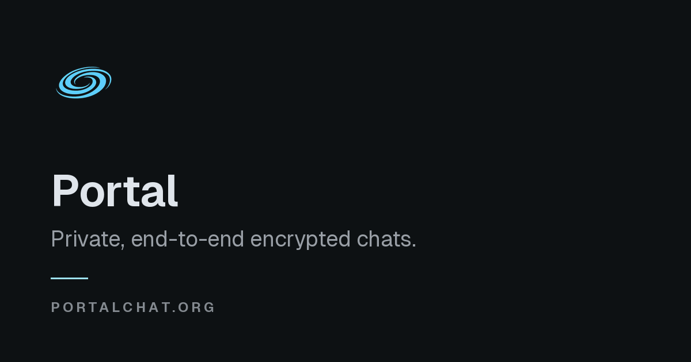

<p align="center">
  
</p>

<h1 align="center">Portal</h1>

<p align="center">
  <strong>MLS-native messaging. Clients hold the keys; the backend orders ciphertext.</strong>
</p>

<p align="center">
  <a href="https://portalchat.org">portalchat.org</a>
</p>



## The boundary

Portal uses [Messaging Layer Security (RFC 9420)](https://www.rfc-editor.org/rfc/rfc9420) for every conversation, including two-person DMs.

Clients own plaintext, MLS group state, attachment keys, and identity private keys. The backend is an **MLS Delivery Service, synchronization authority, and policy-enforcement layer**—not a member of the cryptographic group.

```text
React / iOS clients
  plaintext · MLS epoch secrets · attachment keys · identity keys
                          │
                          │ WebAuthn + typed REST / Socket.IO
                          │ public MLS framing + opaque ciphertext
                          ▼
Portal backend
  device auth · membership policy · epoch CAS · ordering · sync
                          │
            ┌─────────────┼─────────────┐
            ▼             ▼             ▼
       PostgreSQL       Redis 8    Cloudflare R2
       canonical state  timelines   encrypted media
```

The server can see account identity, membership, roles, policy, timing, ordering, ciphertext size, routing, and the public framing of MLS commits. It never receives group secrets or the keys required to decrypt application messages.

## Backend responsibilities

| Boundary | What Portal does |
|---|---|
| Authentication | WebAuthn passkeys, device-scoped sessions, trusted device pairing |
| Authorization | Conversation membership, moderation, roles, and leaf-to-device binding |
| MLS coordination | Validates public commit framing and serializes epoch changes with compare-and-append |
| Messaging | Stores ordered application ciphertext without joining the MLS group |
| Synchronization | Canonical REST timelines, ETags, bounded replay, and revision manifests |
| Realtime | Socket.IO timeline fan-out and narrow invalidation doorbells—not a second source of truth |
| Media | Client-side AES-GCM encryption; opaque blobs in R2; internal imgproxy rendering |
| Calls | WebRTC mesh plus SFU-routed group calls with client-side SFrame encryption |

## Epochs converge by construction

Portal accepts at most one MLS commit against the live epoch. A losing writer receives an epoch conflict, replays the canonical timeline, rebuilds against the new epoch, and retries. Membership changes and key rotations therefore converge on one ordered history without giving the server the secrets needed to validate or decrypt group content.

Welcomes are peeked before they are consumed, so a crash before local persistence cannot destroy a device's only recoverable join material.

## Stack

| Layer | Technology |
|---|---|
| Backend | Python 3.13, FastAPI, async SQLAlchemy, Pydantic, Socket.IO, py-webauthn |
| Web | React 19, TypeScript, Vite, Zustand, Tailwind v4, Zod, Motion |
| Native | Swift / SwiftUI iOS client |
| Cryptography | MLS (RFC 9420), AES-GCM attachments, SFrame calls |
| State | PostgreSQL 16, Redis 8, Alembic migrations |
| Edge | Cloudflare R2, Realtime TURN/SFU, internal imgproxy |

## Architecture discipline

Backend domains follow an enforced acyclic import graph. HTTP handlers own transport and schema validation, services own orchestration and business rules, and repositories own SQLAlchemy persistence. Cross-domain ORM relationships are forbidden; domains cross boundaries through typed service calls and foreign-key identifiers.

The source stays private. The product is live at **[portalchat.org](https://portalchat.org)**.
